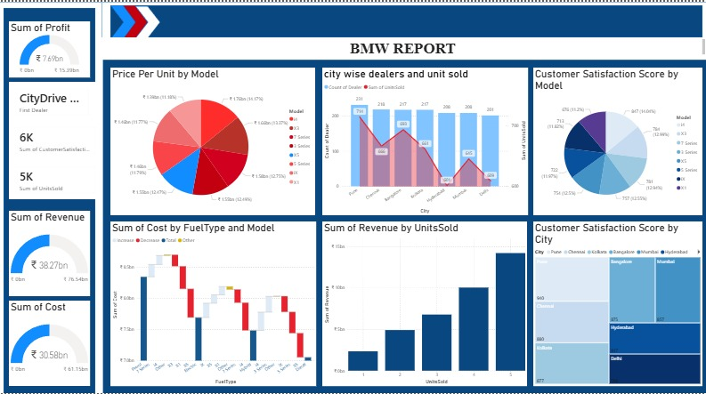

# BMW Sales Analytics Dashboard

## Project Overview

This project is an interactive Power BI dashboard designed to analyze BMW sales performance. It provides insights into revenue, profit, sales trends, customer distribution, and regional performance through interactive visualizations.

## Dataset

The dataset used in this project includes BMW sales information such as region, customer details, vehicle category, revenue, profit, quantity sold, sales trends, and performance metrics.

## Tools Used

- Microsoft Power BI
- Power Query
- DAX
- Data Modeling
- Interactive Dashboards

## Dashboard Preview

The dashboard below presents the final Power BI dashboard developed for BMW sales analysis.



## Key Insights

- Revenue and Profit Analysis
- Sales Trend Analysis
- Regional Sales Performance
- Customer Distribution
- Vehicle Category Analysis
- Monthly Sales Performance
- Business Performance KPIs
- Interactive Filtering and Visualization

## Files

- BMW_Sales_Analytics_Dashboard.pbix
- BMW_Sales_Analytics_Dashboard.png

## License

This project was developed for educational and portfolio purposes.
```
